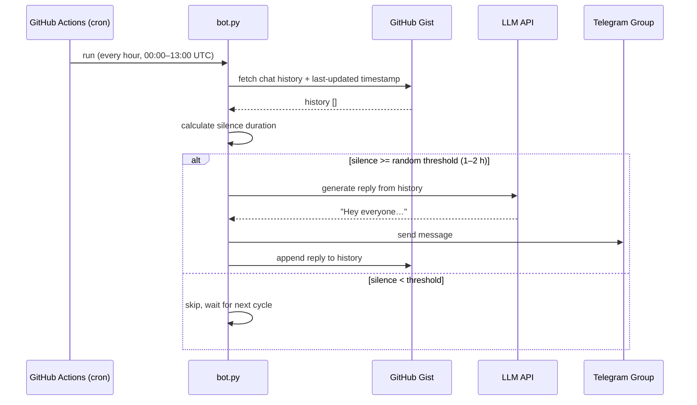

# GroupChat Bot

A scheduled Telegram bot that uses an LLM to autonomously generate and send context-aware messages to a group chat, designed to help keep conversations alive.

> **Why?** Sometimes a group goes quiet, and an occasional nudge from a bot — one that actually reads the conversation history and responds in a natural tone — can be much warmer than a static reminder.

---

## How It Works



## Features

- **LLM-powered responses** — compatible with any OpenAI-compatible API (GPT, Claude, DeepSeek, local Ollama, etc.)
- **Context-aware** — reads previous conversation history before generating a reply
- **Scheduled execution** — runs hourly via GitHub Actions during configurable time windows
- **Variable cadence** — a random silence threshold (1–2 hours) prevents predictable firing
- **Fully serverless** — no VM, no container, no recurring cost
- **Persistence via Gist** — conversation history is stored on GitHub Gist so it survives CI runs

## Tech Stack

| Component                       | Technology                         |
|---------------------------------|------------------------------------|
| Runtime                         | Python 3.10                        |
| Scheduled trigger               | GitHub Actions (cron)              |
| LLM API                         | OpenAI-compatible endpoint (BYOK)  |
| Messaging                       | Telegram Bot API                   |
| History storage                 | GitHub Gist                        |
| Dependencies (total: one)       | `requests`                         |

## Prerequisites

- A [Telegram bot token](https://core.telegram.org/bots/tutorial) (obtain from [@BotFather](https://t.me/BotFather))
- A Telegram group chat ID
- An LLM API key (OpenAI, Anthropic, Groq, Ollama tunnel, or any OpenAI-compatible provider)
- A [GitHub personal access token](https://github.com/settings/tokens) with `gist` scope
- A Gist (create an empty one with a single file named `chat_history.json` containing `[]`)

## Setup

### 1. Fork this repository

### 2. Configure GitHub Secrets

Add the following secrets to your fork under **Settings → Secrets and variables → Actions**:

| Secret              | Description                                     |
|---------------------|-------------------------------------------------|
| `LLM_API_KEY`       | API key for the LLM provider                    |
| `LLM_API_URL`       | Full endpoint URL (e.g. `https://api.openai.com/v1/chat/completions`) |
| `LLM_MODEL_NAME`    | Model identifier, comma-separated if multiple (one is chosen at random each run) |
| `TELEGRAM_BOT_TOKEN`| Token from BotFather                            |
| `TELEGRAM_CHAT_ID`  | Numeric ID of the target group chat             |
| `GIST_ID`           | ID of the Gist (the hash from `https://gist.github.com/you/`**`<hash>`**) |
| `GIST_TOKEN`        | GitHub PAT with `gist` scope                    |

Optional secrets:

| Secret              | Default                                   | Description                              |
|---------------------|-------------------------------------------|------------------------------------------|
| `CUSTOM_PROMPT`     | *English system prompt (see code)*        | Override the LLM system prompt           |
| `FALLBACK_MSG`      | `"Heads up — it's been quiet here… 👀"`  | Fallback message when the API fails      |

### 3. Enable the workflow

The cron schedule runs between **00:00–13:00 UTC** daily. You can:

- Adjust the cron expression in `.github/workflows/notify.yml`
- Manually trigger a run from the Actions tab (`workflow_dispatch`)

## Project Structure

```
.
├── .github/
│   └── workflows/
│       └── notify.yml        # GitHub Actions schedule & deployment
├── bot.py                    # Core bot logic
├── state.json                # Tracks last bot activity for auto-commit
└── README.md
```

## Customization

- **LLM model** — set `LLM_MODEL_NAME` to any model your endpoint supports. Separate multiple models with commas for random selection each run.
- **Response style** — change `CUSTOM_PROMPT` to alter the bot's persona, language, or tone.
- **Schedule** — edit the `cron` line in `notify.yml` to match your timezone. The current window (00:00–13:00 UTC) covers Melbourne daytime hours.
- **History length** — edit `history[-20:]` in `bot.py` to keep more or fewer past messages.

## Local Development

```bash
# Install the single dependency
pip install requests

# Run once (will skip if within the silence threshold)
python bot.py
```

Make sure the required environment variables are set (or create a `.env` and source it).

## License

[MIT](LICENSE) — feel free to use this as a starting point for your own projects.
